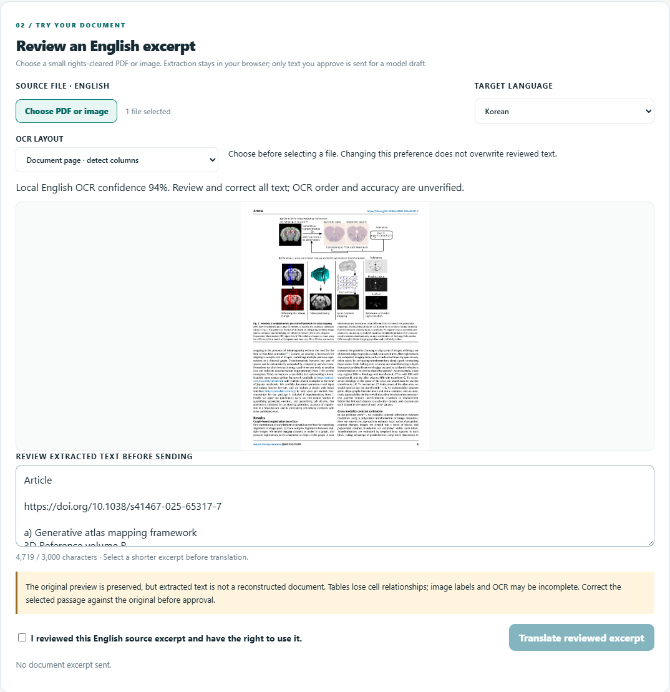

# Complex medical image and two-column intake pilot — 2026-09-30

This is a small, source-verified **extraction** pilot for the MTQC browser workbench. It measures selected English strings in eight input variants, including a two-page research PDF and dense anatomy diagrams. It does not measure medical translation accuracy, image interpretation, figure-label association, or clinical safety. No live model call was made.

## Source selection and rights

| Material | Actual connection and permission | Local input |
| --- | --- | --- |
| [Tward et al., *Nature Communications* (2025), DOI 10.1038/s41467-025-65317-7](https://www.nature.com/articles/s41467-025-65317-7) | Michael I. Miller is a Johns Hopkins University Biomedical Engineering coauthor; this is a multi-institution paper, not a JHU publication or endorsement of MTQC. The publisher marks the article [CC BY 4.0](https://creativecommons.org/licenses/by/4.0/), with its stated third-party-material caveat. The PDF was obtained from the [University of California eScholarship record](https://escholarship.org/uc/item/8cc3z8ph). Figure 1's caption cites other image sources, so the public workbench screenshot below uses Figure 2, whose caption carries no separate exclusion. | 15-page source PDF SHA-256 `9FC60BD279D1FF93473981DB0855EC9715442823ACDA2D1299ED210364093D15`; local two-page excerpt contains published article pages 1–2 (source PDF physical pages 2–3). Figure 2 was separately rendered from physical page 4. |
| [OpenStax *Anatomy & Physiology*, Cranial Nerves illustration](https://commons.wikimedia.org/wiki/File:1320_The_Cranial_Nerves.jpg) | OpenStax file page specifies CC BY 4.0. The source is a 784×491 JPEG with twelve named cranial nerves. | SHA-256 `4EF58BB2A85419D3FCF6F5384AACD08859EFBA3471195EDCE5CCD114418F8060` |
| [Arteries beneath brain](https://commons.wikimedia.org/wiki/File:Arteries_beneath_brain.png) | Commons attributes the plate to the 1918 *Gray's Anatomy* image, with Mikael Häggström/Wikid77 named on the file page. It is marked public domain there. | SHA-256 `9218AA3BD345577180C106F77D3A5B24CEC9074C72D61C67FF62C90754E16063` |
| [Liu et al. spinal AR Figure 1 page](https://www.frontiersin.org/journals/medicine/articles/10.3389/fmed.2024.1403423/full) | Existing [corpus provenance](CORPUS_SOURCES.md) records the CC BY 4.0 source and figure check. A raster page is tested here because its flowchart labels were absent from the searchable PDF text layer. | Existing local page-3 raster input. |

The original research PDF, diagrams and detailed OCR outputs are stored under ignored local `qa/complex-image-20260930`. Public code and source reports do not bundle the full originals. The screenshot below shows a source page inside MTQC's review UI; it is neither an automatically translated page nor a JHU or publisher endorsement.

## Probe and observed results

Each input went through the actual browser file picker and local PDF/OCR worker with live inference disabled. Exact contiguous anchors were chosen from the visible source before scoring. A match does not prove the text was attached to the right anatomical structure, and a miss can include line breaks or OCR spelling changes. Counts are small-case diagnostics, not population accuracy estimates.

| Input | Exact source anchors retained | Main observation |
| --- | ---: | --- |
| JHU-coauthored two-page text PDF | 8/10 after the gutter fix; 6/10 before, rescored with the same corrected anchors | Title, prose and caption remain inspectable. `workflow` and `quantification` were split by the earlier reading-order heuristic. Two labels within Figure 1 remain absent from the PDF text layer, and the app explicitly warns about such labels. |
| Figure 1 full-page raster (document-page OCR) | 6/6 selected anchors | Selected panel labels survive, but unrelated text contains OCR errors, including a misread DOI character. This is not complete figure transcription. |
| Figure 2 full-page raster at ~1200 px height | 7/8 | `Diffeomorphic shape change` is misspelled in OCR. |
| Figure 2 at ~2400 px height, page mode | 7/8 | Higher resolution does not repair that term in this case. |
| Figure 2 at ~2400 px height, diagram mode | 5/8 | Diagram segmentation is worse for this whole article page. Page mode remains the appropriate manual choice. |
| OpenStax cranial nerves JPEG, diagram mode | 7/12 | Several multi-line names are visually present but not an exact contiguous OCR phrase. Manual inspection is needed. |
| Gray brain arteries PNG, diagram mode | 6/11 | Dense leader lines and artwork interfere with exact label extraction. |
| Spine flowchart article-page raster, page mode | 1/5 | The flowchart is visible in the source preview, but its small labels are not reliably transcribed. |

All eight runs completed without browser errors, third-party requests, POST requests, or a bypass of the explicit source-review gate. The local two-page PDF retained every selectable text fragment identity in the geometry check; that check does **not** cover words baked into figures. The eight runs have deliberately unpermitted missing-anchor findings, so the exploratory corpus command exits nonzero on content quality while its runtime and privacy checks pass.

The bounded source fix joins touching PDF glyph fragments when a split fragment crosses the proposed two-column gutter. A new regression was observed failing before the edit and passing afterward. The established 22-input corpus replay then passed every existing runtime, privacy, review and fragment-retention gate with no newly missing annotated content. The release regression now passes 46/46 server checks, 10/10 layout checks, 5/5 corpus-policy checks and 31/31 browser checks.

Screenshot source: Tward et al., *Nature Communications* (2025), Figure 2 and article page 3, DOI [10.1038/s41467-025-65317-7](https://doi.org/10.1038/s41467-025-65317-7), [CC BY 4.0](https://creativecommons.org/licenses/by/4.0/). MTQC adds the browser review interface and OCR text area. The screenshot is a review state, not a completed translation.

## Review decision

The PDF path is useful for selecting a short prose excerpt after reading-order review. A figure label must be checked against the original image; a complete complex diagram should not be forwarded as a verified source based on this OCR alone. For a medical-document claim, show the retained original visual, editable extraction, explicit warning and human approval step together. Keep the exact source/license credit in any public adaptation.
