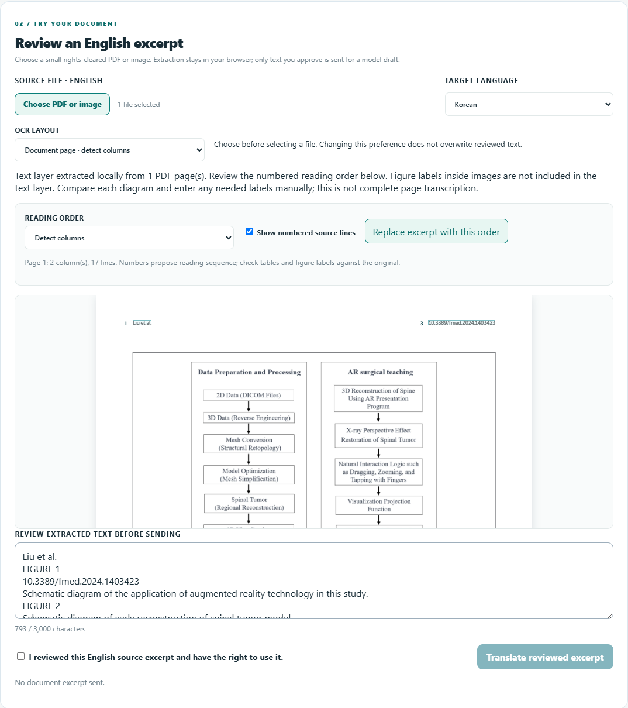

# Medical-document intake evaluation — 2026-09-30

This is an evidence report for the MTQC browser intake workbench, **not** full-document translation, clinical validation, or a multilingual accuracy benchmark. [Sources, licensing and reproduction](CORPUS_SOURCES.md).

## Test design

22 actual inputs cover twelve distinct pages from three medical papers, three Servier anatomy charts, paired pages, scanned images, a degraded JPEG and a mixed searchable/scanned PDF. They exercise the real file picker, local workers, approval gate and reading-order controls. No provider request is made. Original documents and detailed QA outputs are kept local; public code includes the reproducible preparation script, source manifest and explicit anchor/order annotations.

Anchor checks ask whether a short source-grounded string survives; pairwise checks ask whether selected spans occur in the expected sequence. They do not measure every character, table relation, diagram label or medically correct translation. PDF fragment retention measures the selectable text layer only. A picture may contain additional text absent from that layer.

## Findings and corrections

| Finding | Baseline evidence | Change / replay |
| --- | --- | --- |
| PDF cleanup error | 16 of 22 inputs raised a browser error after extraction: `pdf?.destroy is not a function` | Destroy the PDF.js loading task, not the document proxy. Browser error collection is now asserted in regression tests. |
| Narrow journal gutter and centered footer | Spine page 2 had 2/3 selected order edges; ear page 2 retained 4/5 anchors and split a ligature across columns; ear page 3 had 2/3 edges | Robust gutter-edge percentiles and a 1.5%-width minimum handle the observed narrow gap. Revised scores: 3/3, 5/5, 3/3 respectively. Dedicated narrow-gutter and split-ligature regressions were observed failing before the fix. |
| Scanned prose columns interleaved | Synthetic two-column scan failed left-before-right assertion; actual spine scan 1/3 selected order edges, degraded scan 0/3 | Automatic OCR page segmentation passes the new synthetic regression. Actual source/degraded scan each improves to 2/3; spelling and some order errors remain. |
| One OCR segmentation is unsuitable for all inputs | Automatic page segmentation lost one selected venous-chart label that single-block OCR retained | Explicit document-page versus diagram-label OCR choice. Chart evaluation uses diagram mode; scan evaluation uses page mode. This is a reviewer choice, not automatic layout classification. Changing the preference never overwrites existing reviewer text. |
| Searchable PDF silently omits raster labels | Spine page 3 contains flowchart headings visible in the image but absent from the selectable layer | Detect embedded PDF image operations and display an explicit image-label omission warning. The original diagram remains visible; necessary labels must be entered manually. No automatic figure-label recovery is claimed. |
| Corrupt input | Added genuine-signature/broken-body PDF fixture | Safely rejected with no browser error and translation disabled. |

After the text-layer correction, the twelve unique PDF pages retain 52/54 selected anchors and satisfy 25/26 selected order edges, versus 51/54 and 23/26 in the baseline when both are scored with the same corrected annotations. Excluding the explicitly unresolved rotated table, the eleven remaining pages satisfy 49/49 anchors and 24/24 selected edges. These are narrow convenience-sample counts, **not** general accuracy estimates. Duplicate pair runs do not increase the distinct-page count.

## Remaining observed limitations

- **Rotated landscape table, spine page 9:** 3/5 contiguous anchors and 1/2 order edges. All selectable fragments survive, but wrapped cell headings are interleaved with adjacent columns. Row mode helps visual comparison; it does not infer cell membership or reconstruct the table. Do not translate its automatic text as a faithful table.
- **Raster/low-resolution prose:** original and degraded spine scans each retain 4/5 selected anchors and 2/3 edges. Ear diagram-page scan retains 4/5 and 2/3. Local OCR is review-only, including confidence values.
- **Mixed searchable/scanned PDF:** both pages produce editable text, but only 5/9 selected source anchors match in page mode. The rasterized figure-heavy second page needs transcription/correction; automatic segmentation can lose text.
- **Anatomy chart OCR:** diagram mode retains 3/4 Visual System anchors, 4/4 circulation anchors and 4/4 venous anchors. In the visual chart, the title is not retained as an exact contiguous string. A good-looking source/draft preview does not prove all labels were extracted or translated.
- **Diagram text:** raster labels in searchable PDFs are not extracted automatically. A page text layer can retain every selectable fragment while still omitting important visible information.

The runner explicitly identifies these unresolved OCR/table cases. Runtime/privacy gates are strict; known semantic shortcomings are reported, not converted into passing quality scores. Real medical/native-language review remains unperformed.

## Verification and public evidence

Regression suite: .NET 46/46, layout 8/8, browser 26/26. Corpus gates require no browser error, no third-party request, no POST, no approval bypass, no dropped selectable fragment and no unexpected annotated failure. Each test run makes zero billable calls.

Final 22-input replay: all runtime/privacy/review/fragment-retention gates pass. Known OCR/table shortcomings above remain visible in the per-case scores. The loopback run explicitly disabled live inference; zero POST requests and zero external requests were observed. The source files were not sent to Nebius.

Source figure: Liu et al. (2024), Frontiers in Medicine, DOI [10.3389/fmed.2024.1403423](https://doi.org/10.3389/fmed.2024.1403423), PDF page 3 / Figure 1, [CC BY 4.0](https://creativecommons.org/licenses/by/4.0/). MTQC adds the review interface, numbered overlay and warning; the screenshot is not a translated figure or publisher endorsement.
